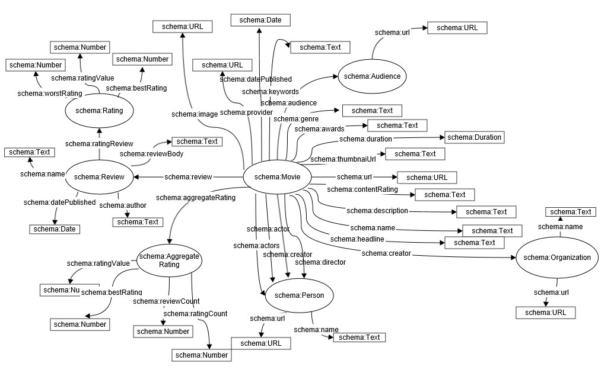

1.	Opis problema
Predmet ovog rada je izrada aplikacije koja vrši ekstrakciju strukturiranih podataka o filmovima i èuva ih u RDF bazu. Podaci o filmovi se nalaze na web stranici  IMDB . Podaci o filmovima opisani su pomoæi meta podataka koji su umetnuti u sam HTML stranice a sami meta podaci su su definisani pomoæu Microdata standarda. Ekstrahovane podatke je zatim potrebno saèuvati u RDF repozitorijumu (bazu podataka) i omoguæiti da im se pristupa putem REST servisa.
Radi kreiranja aplikacije, potrebno je bilo ispuniti sledeæe zahteve:
•	kreiranje web crawlera koji prikuplja stranice sa sajta imdb.com
•	analiziranje strukture web stranice filmova kako bi se ekstrahovali umetnuti Microdata podaci o filmu,
•	kreiranje RDF baze i èuvanje ekstrahovanih podataka o filmu u skladu sa schema.org RDF vokabularom,
•	omoguæavanje pristupa podacima u bazi pomoæu odgovarajuæih REST servisa.

2.	Domenski model
Kreiran je domenski model u skladu sa RDF vokabularom Movie  i predstavljen je na sledeæem dijagramu (slika 1):
 

Slika 1: Domenski model

Klasa Movie sadrži osnovne podatke o filmu. Ona poseduje podatke o nazivu filma, adresi, opisu, trajanju filma, nagradama, žanrovima, datumu objavljivanja kao i o slici filma. Informacije o publici filma iskazuju se preko klase Audience koja sadrži adresu publike. Podaci o glumcima i režiseru filma se iskazuju preko klase Person koja sadrži ime i adresu osobe.
Klasa Organization sadrži informacije o imenu i adresi organizacije koja kreira film.
Klasa AggregateRating sadrži podatke o trenutnoj oceni filma, tako što vodi raèuna o broju komentara, broju pregleda, proseènoj oceni svih komentara, najboljoj i najgoroj oceni filma.
Klasa Review predstavlja komentar korisnika na odreðeni film. Ona sadrži  podatke o  autoru, nazivu komentara, datumu objavljivanja i opisu, odnosno samom tekstu komentara. Prilikom ostavljanja kometara, korisnik daje i ocenu samog filma, koja se predstavlja klasom Rating. Ona sadrži podake o najmanjoj i najveæoj moguæoj oceni, kao i o oceni koju je dao autor komentara.
3.	Rešenje
U skladu sa postavljenim problemom i specifiènim zahtevima, kreirana je aplikacija koja omoguæava kreiranje repozitorijuma transformacijom postojeæih podataka. Konkretno, aplikacija prikuplja meta podatke o filmovima predstavljenim preko Microdata standarda sa web sajta IMDB. Na osnovu prikupljenih podataka kreira odgovarajuæe objekte domenskog modela, a zatim te objekte èuva u lokalnu RDF bazu. Aplikacija dalje omoguæava pristup saèuvanim podacima pomoæu RESTful servisa.
Aplikacija omoguæava  dva REST servisa:
GET/api/movies - vraæa podatke o filmovima. Opcioni parametri su:
•	name - reè u nazivu filma
•	genre - željeni žanr (moguce vrednosti: comedy, drama, romace, mystery, history ..)
•	director - rec u nazivu rezisera
•	actor - rec u nazivu glumca
•	minAggregateRating  - minimalna ocena koju bi film trebao da ima
•	minDuration - minimalno trajanje filma
•	maxDuration - maksimalno trajanje filma
•	hasAward - samo nagradjivani filmovi (moguce vrednosti true, false)
•	minReleaseYear - minimalna godina objavljivanja
•	maxReleaseYear - maksimalna godina objavljivanja
•	limit – broj rezultata

  Primer poziva ovog servisa:
GET/api/movies?name=Igre&genre=Adventure&minReleaseYear=2010

GET/api/movies/id/reviews   vraca komentare filma sa zadatim id-jem. Opcioni parametri su: 
•	name rec u nazivu komentara 
•	author rec u nazivu autora

Primer poziva ovog servisa:
GET/api/movies/b6086735-d0fd-4e2b-8adc-6cdd98becc36/reviews?name=scary&author=www

4.	Tehnièka realizacija
Aplikacija je raðena u programskom jeziku Java, u razvojnom okruženju Eclipse. 
U aplikaciji je korišæena Jsoup biblioteka za analiziranje web stranica i prikupljanje podataka sa njih. Jsoup biblioteka  omoguæava parsiranje HTML stranica pomoæu pogodnog API-a za ekstrakciju podataka, kao i pretragu i manipulaciju podacima. Ona takoðe i omoguæava pristup željenim DOM elementima.
Za mapiranje Java objekata u RDF putem anotacija korišæena je Jenabean biblioteka. Biblioteka pruža moguænost da se Java klase kreiraju na klasièan naèin, a zatim se dodavanjem odgovarajuæih anotacija definiše naèin na koji æe se one mapirati u RDF klase
Za skladištenje podataka u RDF repozitorijum korišæena je TDB komponenta Jena framework-a, koja, pored skladištenja, omoguæava i izvršavanje razlièitih vrsta SPARQL upita nad podacima u RDF formatu. 
Obezbeðivanje i rad sa RESTful servisima implementiran je pomoæu Jersey framework-a, koji olakšava kreiranje web servisa u Javi. Web servisi se kreiraju putem anotacija, kojima se definiše vrsta HTTP zahteva na koju taj servis odgovara kao i putanja do odgovarajuæeg resursa. Na osnovu anotacija, odreðene klase su predstavljene kao resursi, koji sadrže anotacijama oznaèene metode koje prihvataju i obraðuju HTTP zahteve. 
